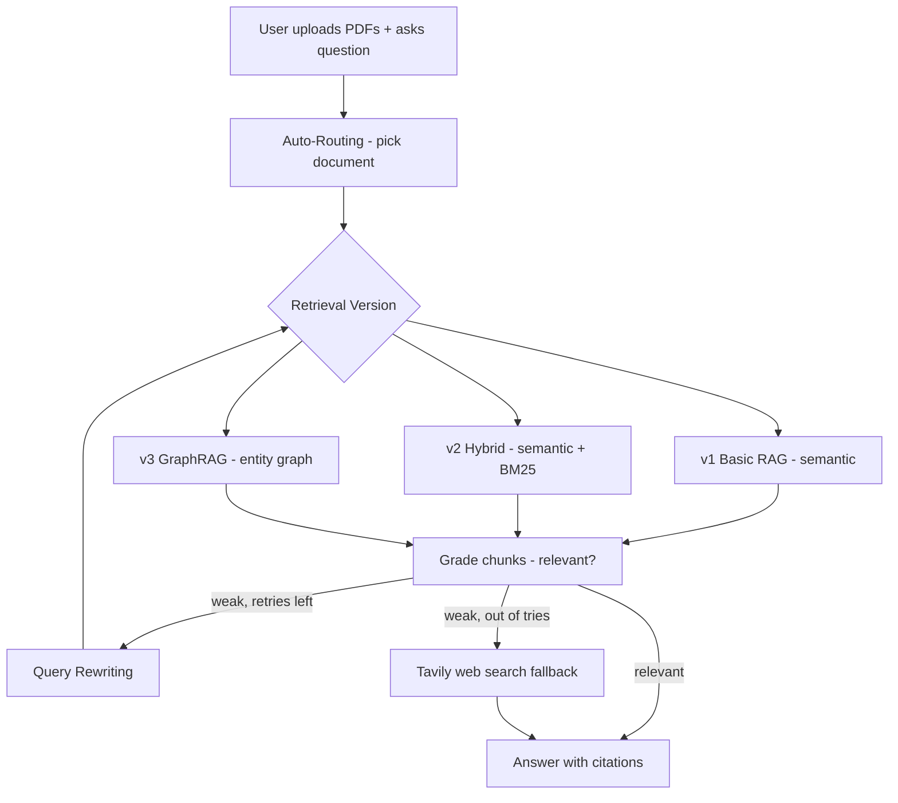

# 🤖 Advanced RAG Document Assistant — 3 Versions + Corrective RAG

A document Q&A app that lets you upload PDFs and ask questions in plain English. It implements three retrieval strategies (Basic RAG, Hybrid Search, GraphRAG) plus Corrective RAG with a web-search fallback.

## 🚀 Live Demo
**[Try it here](https://gen-ai-fundamentals-murtaza-document-assistant.streamlit.app/)**

## 📌 The Business Problem
Teams waste hours searching through long PDFs — contracts, policies, manuals, reports — to find one answer. **This app finds the answer instantly, with the exact source page cited**, and falls back to the web when the documents don't cover it.

## 🏗️ Architecture



## ⚙️ Three RAG Versions
- **v1 — Basic RAG:** semantic similarity search (ChromaDB)
- **v2 — Hybrid Search:** semantic + BM25 keyword search, combined
- **v3 — GraphRAG:** builds a knowledge graph (NetworkX) of entities and retrieves connected information

## 🔧 Corrective RAG
After retrieval, an LLM grades whether the chunks are relevant. If weak, it rewrites the query and retries; if still weak after 3 tries, it falls back to a Tavily web search (clearly labeled as web info).

## ✅ Results / What It Does
- Multi-document upload with **metadata filtering** and **self-query routing** (LLM picks the document)
- **Source citations** — every answer shows the document and page
- **Hallucination prevention** — answers only from documents; says so when info is missing
- Tested on a real 16-page insurance document — correctly answered covered questions and honestly flagged what lived in a separate document (no hallucination)

## 📸 Screenshots

**App interface**


<br>

**Answer with citation**


<br>

## 🛠️ Tech Stack
- **LLM:** Groq + LLaMA 3.3 70B
- **Framework:** LangChain
- **Vector DB:** ChromaDB
- **Keyword Search:** BM25
- **Knowledge Graph:** NetworkX
- **Web Search:** Tavily
- **Embeddings:** HuggingFace all-MiniLM-L6-v2
- **Frontend:** Streamlit

## ▶️ Run Locally
1. Clone the repo:
```
git clone https://github.com/Murtaza-data/advanced-rag-assistant.git
cd advanced-rag-assistant
```
2. Install dependencies:
```
pip install -r requirements.txt
```
3. Add your Tavily key to `.streamlit/secrets.toml`, enter your Groq key in the sidebar
4. Run the app:
```
streamlit run app.py
```
